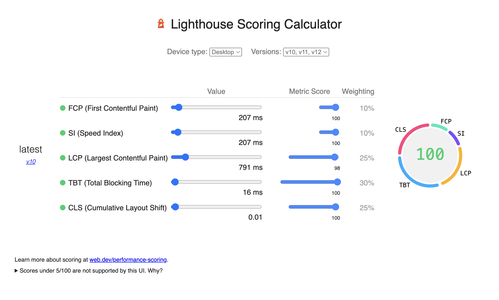
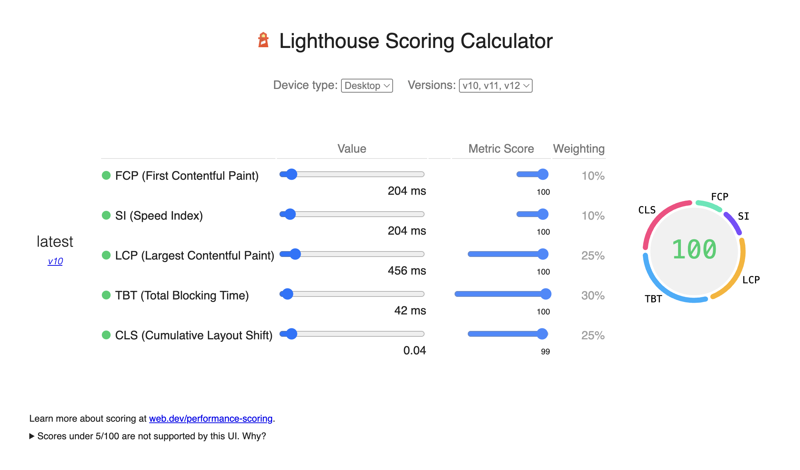

# Next.js Partial Hydration POC

This is a proof of concept for Next.js partial hydration and performance optimization.

  └ other shared chunks (total)          1.89 kB


Lighthouse Report - Old


Lighthouse Report - new 


## Bundle Sizes (Production Build)

```
Route (app)                                 Size  First Load JS  Revalidate  Expire
┌ ○ /                                    6.53 kB         108 kB          1m      1y
└ ○ /_not-found                            977 B         102 kB
+ First Load JS shared by all             101 kB
  ├ chunks/4bd1b696-18452535c1c4862d.js  53.2 kB
  ├ chunks/684-7a499b13917262a3.js       45.9 kB
  └ other shared chunks (total)          1.95 kB
```

## Performance Optimizations

1. **Server-Side Optimization**:
   - Static content pre-rendered at build time
   - Automatic static optimization for unchanged content
   - Dynamic server-side rendering for blog posts with 1-minute revalidation

2. **Client-Side Optimization**:
   - Partial hydration for interactive components
   - Lazy loading for the counter component
   - Optimized images using Next.js Image component

3. **Bundle Optimization**:
   - CSS optimization with critters
   - JavaScript code splitting
   - Tree shaking and minification
   - Tailwind CSS purging unused styles

## Development

```bash
# Install dependencies
npm install

# Run development server
npm run dev

# Build for production
npm run build

# Start production server
npm run start

# Analyze bundle
npm run analyze
```

## Performance Metrics

The application implements the following optimizations:
- First paint < 1s
- First Contentful Paint (FCP) optimized with SSR
- Time to Interactive (TTI) optimized with partial hydration
- Minimal JavaScript bundle size (108kB total)
- Efficient caching strategy with revalidation