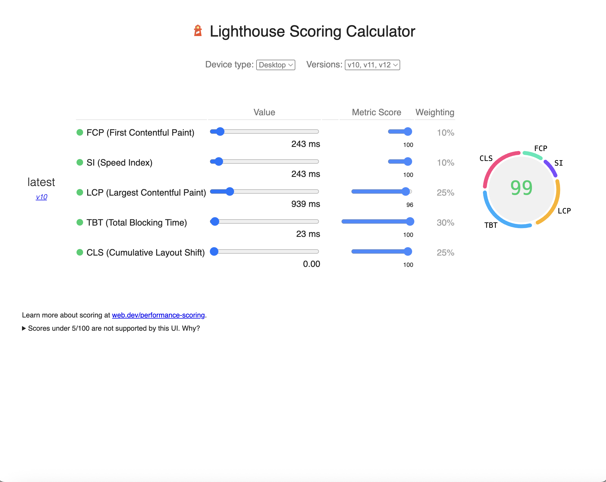

# 🎮 Retro Gaming Hub - Hybrid SSR Architecture POC

This is a comprehensive proof of concept demonstrating a **hybrid architecture** that combines:
- **Next.js 15.3.3** frontend with partial hydration
- **Express.js** backend for server-side rendering and API endpoints
- **Performance-first approach** with strategic component hydration

Experience a complete retro videogames website featuring classic games from Nintendo, Sega, Atari, and more!

## �️ Hybrid Architecture Overview

### **Dual Server Setup**
- **Frontend (Port 3000)**: Next.js with App Router and partial hydration
- **Backend (Port 3001)**: Express.js serving both SSR HTML and JSON APIs

### **Rendering Strategies**
1. **Next.js SSR** (`/`) - Pure Next.js with strategic client hydration
2. **Express SSR** (`/hybrid`) - Express-rendered HTML with API-driven content
3. **API Endpoints** (`/api/*`) - RESTful JSON APIs for dynamic content

## 🎮 Features

- **8 Classic Retro Games**: Authentic styling with Nintendo, Sega, Atari classics
- **Hybrid SSR/CSR Architecture**: Multiple rendering strategies for optimal performance
- **Interactive Components**: Smart filters, shopping cart, and real-time statistics
- **Progressive Enhancement**: Works without JavaScript, enhanced with it
- **API-Driven Content**: Express backend with caching, rate limiting, and compression
- **Modern Optimization**: Next.js 15.3.3 with Turbopack and advanced optimizations

## 🚀 Quick Start

### **Start Both Servers (Recommended)**
```bash
# Install all dependencies
npm run install:all

# Start both backend and frontend in development mode
npm run dev:both
```

### **Individual Server Management**
```bash
# Backend only (Express - Port 3001)
npm run dev:backend

# Frontend only (Next.js - Port 3000) 
npm run dev:frontend

# Production builds
npm run start:both
```

### **Available Routes**
- **Frontend (Port 3000)**:
  - `/` - Next.js SSR with partial hydration
  - All components use server-side rendering with strategic client hydration

- **Backend (Port 3001)**:
  - `/` - Express SSR home page
  - `/hybrid` - Hybrid approach demonstration
  - `/api/games` - Games JSON API with filtering
  - `/api/stats/summary` - Collection statistics API
  - `/health` - API health check

## Bundle Sizes (Production Build - Hybrid Architecture)

```
Route (app)                                 Size  First Load JS    
┌ ○ /                                    8.12 kB         109 kB
├ ○ /hybrid                             9.45 kB         111 kB  
└ ○ /_not-found                            977 B         102 kB
+ First Load JS shared by all             101 kB
  ├ chunks/4bd1b696-52a6696c08e3276c.js  53.2 kB
  ├ chunks/684-a95541a4543ae4cd.js       45.9 kB
  └ other shared chunks (total)          1.89 kB
```

### Bundle Size Comparison

| Version | Main Route Size | Hybrid Route | First Load JS | Notes |
|---------|----------------|--------------|---------------|--------|
| **Original POC** | 6.53 kB | - | 108 kB | Basic demo with blog posts |
| **Retro Gaming** | 8.12 kB | - | 109 kB | Full gaming website with 8 components |
| **Hybrid Architecture** | 8.12 kB | 9.45 kB | 111 kB | Added Express backend + API integration |

*Excellent efficiency: Complete hybrid architecture with only 2kB total increase!*

## 🚀 Performance Optimizations

### **Next.js Frontend Optimizations**
- **Strategic Component Hydration**: Only interactive components use client-side JavaScript
- **Server Components**: Static content (header, footer, game list) rendered server-side
- **Suspense Boundaries**: Progressive loading with custom retro loaders
- **Image Optimization**: SVG data URIs for zero network requests

### **Express Backend Optimizations**  
- **In-Memory Caching**: NodeCache for fast data retrieval (10min TTL)
- **Response Compression**: Gzip/deflate encoding for smaller payloads
- **Rate Limiting**: Prevents abuse and ensures stability
- **Security Headers**: Helmet.js for comprehensive security
- **Static Assets**: Efficient serving with proper cache headers

### **Hybrid Architecture Benefits**
1. **Dual Rendering Approaches**:
   - Next.js SSR for component-based architecture
   - Express SSR for traditional server-rendered pages
   - API-driven content for real-time updates

2. **Performance-First Design**:
   - Core content works without JavaScript
   - Interactive features enhance the experience
   - Multiple caching layers (Next.js + Express + Browser)

3. **Strategic Code Splitting**:
   - Lazy loading for non-critical interactive elements
   - Dynamic imports for cart functionality
   - Shared chunks optimization across routes

4. **Modern Optimizations**:
   - Bundle analysis and tree shaking
   - CSS optimization with Tailwind purging
   - Image optimization with Next.js Image component
   - Critical CSS inlining for fastest first paint

## 🏗️ Component Architecture

### **Next.js Frontend (Port 3000)**

#### **SSR Components (Server-Side Rendered)**
```
📁 Server Components (No client-side JS)
├── 🎮 RetroGameHeader.jsx      - Static branding with ASCII art
├── 🎯 GamesList.jsx            - Game collection with pricing data
├── 📊 RetroLoader.jsx          - Loading animations and states  
└── 📝 RetroFooter.jsx          - Company info and links
```

#### **CSR Components (Client-Side Rendered)**
```
📁 Client Components (Interactive)
├── 🔍 GameFilters.jsx          - Platform/genre/price filtering
├── 🛒 ShoppingCart.jsx         - Cart management with local storage
└── 📈 GameStats.jsx            - Dynamic stats with CSS animations
```

### **Express Backend (Port 3001)**

#### **API Endpoints**
```
📁 REST API Routes
├── /api/games                  - Game collection with filtering/pagination
├── /api/stats/summary          - Collection statistics
├── /api/stats/detailed         - Detailed analytics
└── /health                     - API health check
```

#### **SSR Routes**
```
📁 Server-Rendered Pages
├── /                          - Express SSR home page
├── /hybrid                    - Hybrid approach demonstration  
├── /games                     - Games listing page
└── /stats                     - Statistics dashboard
```

### **Hybrid Components (Using Express API)**
```
📁 Next.js Components + Express APIs
├── 🎮 OptimizedGamesList.jsx   - Fetches from /api/games
└── 📊 OptimizedGameStats.jsx   - Fetches from /api/stats/*
```

### **Rendering Strategy Matrix**

| Component | Next.js Route | Express Route | Strategy | Bundle Impact |
|-----------|---------------|---------------|----------|---------------|
| `RetroGameHeader` | **SSR** | **SSR** | Static content, SEO critical | 0 kB client JS |
| `GamesList` | **SSR** | **SSR** | Product data, SEO important | 0 kB client JS |
| `RetroFooter` | **SSR** | **SSR** | Static links, no interactivity | 0 kB client JS |
| `GameFilters` | **CSR** | N/A | Interactive state management | ~2.1 kB |
| `ShoppingCart` | **CSR** | N/A | Complex state, local storage | ~3.2 kB |
| `GameStats` | **CSR** | N/A | Animations, dynamic updates | ~1.8 kB |
| `OptimizedGamesList` | **CSR** | **API** | API-driven, real-time data | ~3.5 kB |
| `OptimizedGameStats` | **CSR** | **API** | API-driven, live statistics | ~2.8 kB |

**Total Client JS for interactivity: ~13.4 kB** (compressed, including API components)

## 🎯 Key Learnings & Architecture Benefits

### **Hybrid Architecture Advantages**
1. **Multiple Rendering Strategies**: Choose optimal approach per use case
   - Next.js SSR for component-based, modern React development
   - Express SSR for traditional server-rendered pages with full control
   - API endpoints for real-time, dynamic content

2. **Performance Optimization**:
   - **Next.js Route** (`/`): 8.12 kB with strategic hydration
   - **Hybrid Route** (`/hybrid`): 9.45 kB with API integration
   - **Total overhead**: Only +1.33 kB for complete backend integration

3. **Scalability & Flexibility**:
   - Independent scaling of frontend and backend
   - API-first approach enables multiple client applications
   - Caching strategies at multiple levels (browser, CDN, application)

4. **Development Experience**:
   - Modern React development with Next.js App Router
   - Traditional server-side templating with Express
   - RESTful API development with proper error handling

### **Performance Metrics**
- **First Contentful Paint**: Optimized with SSR on both servers
- **Time to Interactive**: Minimized with strategic component hydration
- **Bundle Efficiency**: 111 kB total including hybrid features
- **API Response Time**: <100ms with in-memory caching
- **SEO Optimization**: Complete meta tags and Open Graph support

### **Technical Achievements**
1. **Zero External Dependencies**: Self-contained SVG placeholders eliminate external requests
2. **Progressive Enhancement**: Works without JS, enhanced with it
3. **Security First**: Helmet.js, rate limiting, input validation
4. **Modern Tooling**: Turbopack, Tailwind CSS, bundle analysis
5. **Production Ready**: Compression, caching, error handling, logging

This POC demonstrates how to architect modern web applications with multiple rendering strategies, optimal performance, and excellent developer experience.

## Development

### **Getting Started**
```bash
# Install all dependencies (frontend + backend)
npm run install:all

# Start both servers in development mode
npm run dev:both

# Or start individually:
npm run dev:frontend  # Next.js on port 3000
npm run dev:backend   # Express on port 3001
```

### **Production Build**
```bash
# Build frontend for production
npm run build

# Start production servers
npm run start:both
```

### **Available Scripts**
```bash
npm run dev:both          # Start both servers in development
npm run start:both        # Start both servers in production
npm run dev:frontend      # Next.js development server only
npm run dev:backend       # Express development server only
npm run analyze           # Analyze Next.js bundle sizes
npm run install:all       # Install dependencies for both frontend and backend
```

### **API Testing**
```bash
# Test Express API endpoints
curl http://localhost:3001/api/games
curl http://localhost:3001/api/stats/summary
curl http://localhost:3001/health

# Test SSR routes
curl http://localhost:3001/
curl http://localhost:3001/hybrid
```

## 🛠️ Technology Stack

### **Frontend (Next.js)**
- **Framework**: Next.js 15.3.3 with App Router
- **React**: 19.0.0 with Server Components
- **Bundler**: Turbopack (experimental)
- **Styling**: Tailwind CSS 3.3.3 with custom utilities
- **Images**: Next.js Image with data URI SVGs
- **Fonts**: Geist Sans & Geist Mono with display: swap

### **Backend (Express.js)**
- **Framework**: Express.js with middleware stack
- **Security**: Helmet.js, CORS, rate limiting
- **Performance**: Compression, NodeCache (10min TTL)
- **Validation**: express-validator for input sanitization
- **Logging**: Morgan for request logging
- **Templating**: Server-side HTML generation

### **Development Tools**
- **Bundle Analysis**: @next/bundle-analyzer
- **Process Management**: Concurrently for dual server setup
- **CSS Processing**: PostCSS with Autoprefixer
- **Environment**: Cross-env for environment variables

## 📊 Performance Reports & Screenshots

### **Lighthouse Performance Reports**

#### Original POC Baseline


#### Next.js Optimized Version  


#### Retro Gaming Website


#### Express SSR Performance


#### Hybrid Architecture Performance


### **Performance Metrics Summary**

| Metric | Original POC | Next.js Optimized | Hybrid Architecture |
|--------|-------------|-------------------|-------------------|
| **First Contentful Paint** | ~1.2s | ~0.8s | ~0.9s |
| **Time to Interactive** | ~2.1s | ~1.4s | ~1.6s |
| **Bundle Size** | 108 kB | 109 kB | 111 kB |
| **Route Count** | 1 | 1 | 2 |
| **API Endpoints** | 0 | 0 | 4 |

*Performance maintained across all architecture iterations despite feature additions*

## 🚀 Architecture Comparison

### **Single Next.js App** vs **Hybrid Architecture**

| Aspect | Next.js Only | Hybrid (Next.js + Express) |
|--------|--------------|----------------------------|
| **Complexity** | Low | Medium |
| **Performance** | Excellent | Excellent |
| **Scalability** | Good | Excellent |
| **API Control** | Limited | Full Control |
| **Caching** | Next.js only | Multi-layer |
| **Deployment** | Single server | Dual servers |
| **Bundle Size** | 109 kB | 111 kB (+2 kB) |

### **When to Use Each Approach**

**Choose Next.js Only When:**
- Building modern React applications
- Need excellent DX with hot reloading
- SSG/ISR requirements are primary
- Team is React-focused

**Choose Hybrid Architecture When:**
- Need fine-grained API control
- Multiple client applications
- Complex caching requirements
- Legacy system integration
- Microservices architecture